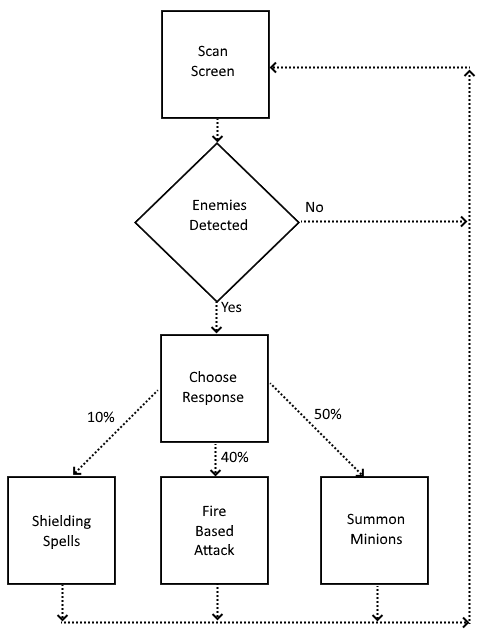

## StateNet overview

This library allows a user to configure a network describing the flow through states in their application and then traverse the network at runtime in response to the inputs generated by their application.

Where a standard Finite State Machine (FSM) creates one link between two states for a given input, StateNet allows multiple connections for a single input between two states. These connections each have an expression which gives a weight when evaluated at runtime based on the previous inputs applied and states visited. The Engine randomly chooses one of these connections influenced by its weight and transitions into the selected connection's target state.

The network's States, Inputs and Connections can be modified at runtime if the user wishes.

## Sample Project

Consider a generic automation tool - lets call it ABot for this project. A simple version of ABot might deal with one (linear) task at a time. But when you want ABot to try and immitate a user (for testing, performance-evaluation, bot-detection-prevention, or any other purpose), strictly linear behaviours are often no longer enough.

For simplicity, lets make ABot a less generic game-playing automaton that follows this set of rules:

 You can use StateNet to define a series of states for the bot to move through as it plays - transitions that would be ~~impossible~~ tricky to define in a regular FSM. For example, in a regular FSM `Choose Response` (and all of it's target states) would involve several cascading conditionals that explicitly invoke an RNG. Our StateNet defined version allows us to declare 3 possible sets of actions, and the odds of each one being picked. As each state reaches completion, StateNet handles the invokation of whatever comes next.

### ABot code

> TODO - add a series of states and explanations to match the game-bot image above.